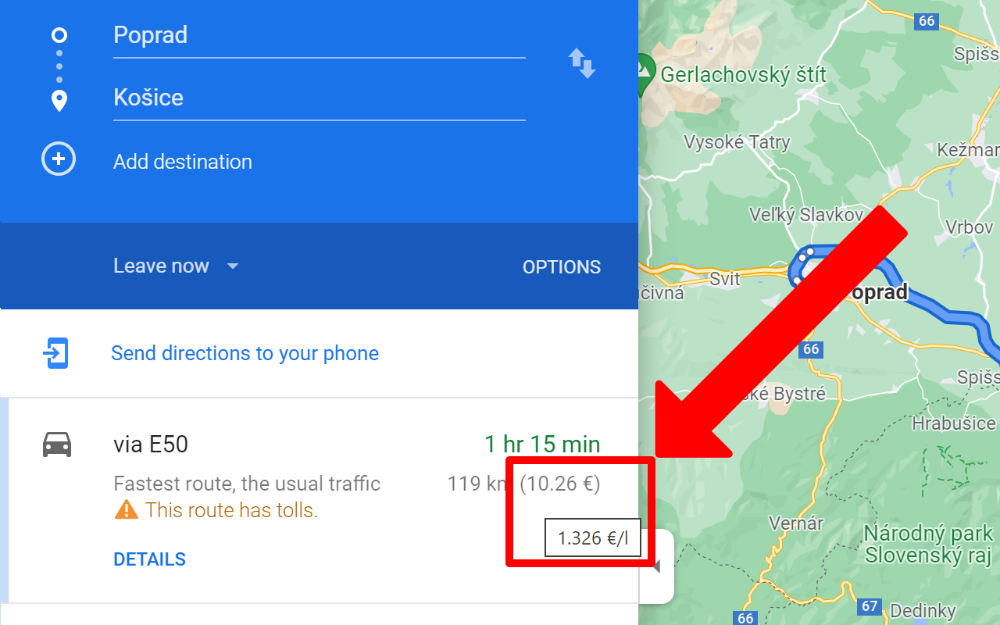

#  Cost of driving in Google Maps

Automatically show the cost of rides by your vehicle in the Google Maps list of directions based on the current average fuel price.

The extension automatically calculates and shows the approximate cost of a trip for electric or classic (combustion) vehicles based on the current average fuel price, the distance of the route, and the average consumption of your vehicle.

You can set your custom values anytime on the options page.

\* Automatic detection of the average fuel price is currently available only in Slovakia

## Browser extensions

[Chrome](https://chrome.google.com/webstore/detail/cost-of-driving-in-google/glajpeclpoeodmfofkelgedjphkdgmie) | [Firefox](https://addons.mozilla.org/en-US/firefox/addon/cost-of-driving-in-google-maps) |
-- | --
 |  |

## Screenshots

### List of directions

### Options for diesel vehicles

### Options for electric vehicles
