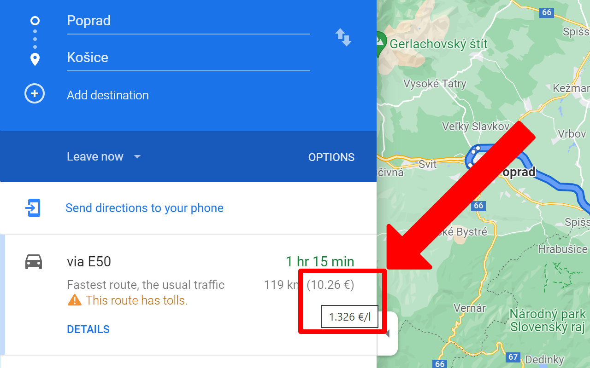
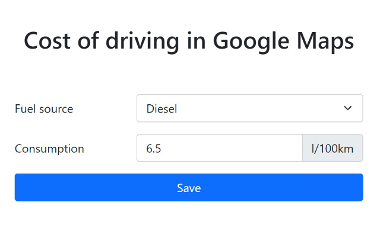
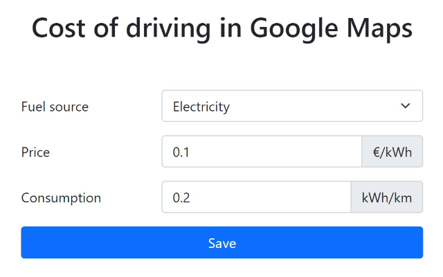

#  Cost of driving in Google Maps

Automatically show the cost of rides by your vehicle in the Google Maps' list of routes based on the current average fuel price.

Simplify your planning of trips with automatic calculation of the cost of rides by your vehicle directly in the Google Maps' list of routes.

The extension automatically calculates and shows the approximate cost of a trip for electric or classic (combustion) vehicles based on the current average price of fuel or energy, the distance of the route, and the average consumption of your vehicle.

\* Automatic detection of the average fuel price is currently available only in Slovakia.

## Browser extensions

[Chrome](https://chrome.google.com/webstore/detail/cost-of-driving-in-google/glajpeclpoeodmfofkelgedjphkdgmie) | [Firefox](https://addons.mozilla.org/en-US/firefox/addon/cost-of-driving-in-google-maps) | [Edge](https://microsoftedge.microsoft.com/addons/detail/cost-of-driving-in-google/pkaabdlnneddeecggbpfmdcjknmjeddl)
-- | -- | --
 |  | 

## Screenshots

### List of routes

### Options for diesel vehicles

### Options for electric vehicles
